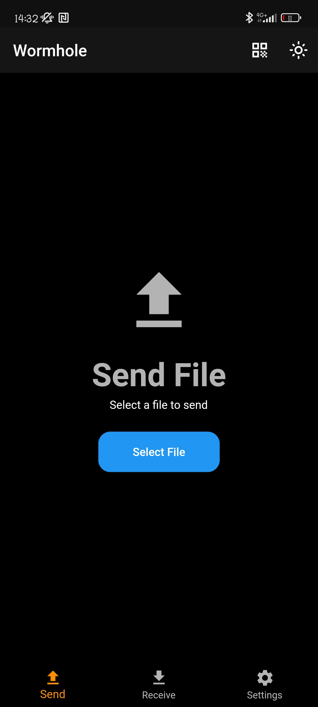

# Wormhole

An open source Android App for sending/receiveing files using the magic-wormhole protocol.

## Preview

 
 

## Features

- Open source: Lightweight, clean and secure.
- Send/receive files via the magic-wormhole protocol
- Generate QR code of receive code
- Scan QR-Code of sender
- Dark theme

## License

    Copyright (C) 2023 Lukas Heiligenbrunner

    This program is free software: you can redistribute it and/or modify
    it under the terms of the GNU General Public License as published by
    the Free Software Foundation, either version 3 of the License, or
    (at your option) any later version.

    This program is distributed in the hope that it will be useful,
    but WITHOUT ANY WARRANTY; without even the implied warranty of
    MERCHANTABILITY or FITNESS FOR A PARTICULAR PURPOSE.  See the
    GNU General Public License for more details.

    You should have received a copy of the GNU General Public License
    along with this program.  If not, see <https://www.gnu.org/licenses/>.
