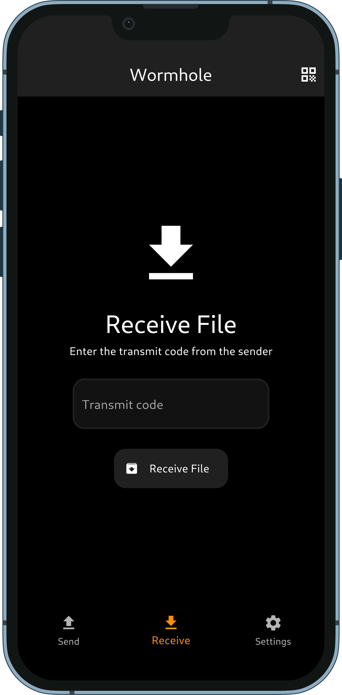
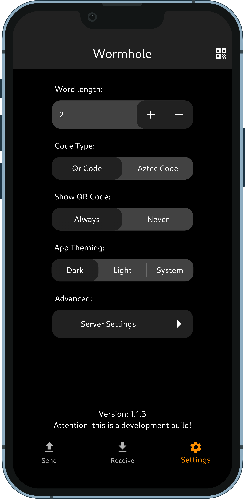

# Wormhole

An open source Android, iOS, macOS, and Windows App for sending/receiveing files using the magic-wormhole protocol.

## Preview

 
 

## Features

- Open source: Lightweight, clean and secure.
- Send/receive files via the magic-wormhole protocol
- Generate QR code of receive code
- Scan QR-Code of sender
- Dark theme

## Compatible Desktop Applications:

- [Warp](https://apps.gnome.org/app/app.drey.Warp/)

(feel free to add yours)

# Translation
We use [Codeberg Translate](https://translate.codeberg.org/projects/wormhole/).

## Development

### Prerequisites
- Flutter (>= 3.22.0)
- Rust (MSRV >= 1.85.1)
- Just

**Android only:**
- Android NDK
- Android SDK (>= 31)

### Build app

#### Android

Add Rust Android targets:\
`rustup target add aarch64-linux-android armv7-linux-androideabi i686-linux-android x86_64-linux-android`

Install cargo-ndk:\
`cargo install cargo-ndk`

Build APK + App Bundle:\
`just apk`

#### Linux

Dev build:\
`just linux`

#### macOS

Dev build:\
`flutter build macos`

#### Windows

Dev build:\
`flutter build windows`

### Format/Lint

Format source code:\
`just format`

Lint source code:\
`just lint`

### Code generation

Generate translations:\
`just translation`

Generate Flutter-Rust-Bridge code bindings:\
`just codegen`

### Cleanup 

Clean build files:\
`just clean`

## Contribution

Every kind of contribution is welcome. :) 

If you know other languages than English/German/Swedish feel free to add new translations in `lib/l10n/`.
If you face any issues with the app you can gladly open an issue or fix it via a PR.

## Used libraries

A great thanks to all the maintainers of the used libraries. 
Especially to [magic-wormhole](https://crates.io/crates/magic-wormhole) and [flutter_rust_bridge](https://github.com/fzyzcjy/flutter_rust_bridge).

## Flutter

* [flutter_rust_bridge](https://github.com/fzyzcjy/flutter_rust_bridge)(MIT) - Flutter <-> Rust ffi code generation
* [ffi](https://pub.dev/packages/ffi)(BSD-3-Clause) - call native .so lib code from dart
* [file_picker](https://pub.dev/packages/file_picker)(MIT) - OS Native Filepicker Impl.
* [path_provider](https://pub.dev/packages/path_provider)(BSD-3-Clause) - Get Platforms common paths
* [share_plus](https://pub.dev/packages/share_plus)(BSD-3-Clause) - Open Platforms share dialog
* [open_filex](https://pub.dev/packages/open_filex)(BSD-3-Clause) - Open Platforms file-open dialog
* [barcode_widget](https://pub.dev/packages/barcode_widget)(Apache-2.0) - QR/Aztec code generation
* [flutter_zxing](https://pub.dev/packages/flutter_zxing)(MIT) - QR/Aztec code scanner
* [provider](https://pub.dev/packages/provider)(MIT) - Consumer/Provider patterns
* [shared_preferences](https://pub.dev/packages/shared_preferences)(BSD-3-Clause) - Platform wrapper for key-value pairs
* [share_handler](https://pub.dev/packages/share_handler)(MIT) - receive of platform share intents
* [vibration](https://pub.dev/packages/vibration)(BSD-2-Clause) - control haptic feedbacks
* [intl](https://pub.dev/packages/intl)(BSD-3-Clause) - handle localisation
* [fluttertoast](https://pub.dev/packages/fluttertoast)(MIT) - pretty toast popups
* [toggle_switch](https://pub.dev/packages/toggle_switch)(MIT) - pretty toggle switches
* [permission_handler](https://pub.dev/packages/permission_handler) (MIT) - handle platform permissions
* [url_launcher](https://pub.dev/packages/url_launcher) (BSD-3-Clause) - open urls in platform default browser
* [flutter_close_app](https://github.com/wormhole-app/wormhole/tree/main/packages/flutter_close_app)(MIT) - proper close of app
* [media_scanner](https://pub.dev/packages/media_scanner) (MIT) - trigger media library scan on Android
* [device_info_plus](https://pub.dev/packages/device_info_plus) (BSD-3-Clause) - get device information
* [app_links](https://pub.dev/packages/app_links) (Apache-2.0) - handle deep linking/universal links
* [logger](https://pub.dev/packages/logger) (MIT) - structured logging
* [rotation_log](https://pub.dev/packages/rotation_log) (MIT) - log file rotation and archiving

## Rust

* [anyhow](https://crates.io/crates/anyhow)(MIT) - Error handling
* [magic-wormhole](https://crates.io/crates/magic-wormhole)(EUPL-1.2) - magic-wormhole client
* [futures](https://crates.io/crates/futures)(MIT) - async/await async programming
* [async-std](https://crates.io/crates/async-std)(MIT) - async std-lib
* [url](https://crates.io/crates/url)(MIT) - url generation lib
* [zip](https://crates.io/crates/zip)(MIT) - ZIP file compression/decompression
* [fastrand](https://crates.io/crates/fastrand)(MIT) - fast random number generation
* [log](https://crates.io/crates/log)(MIT) - logging facade for Rust
* [flutter_logger](https://crates.io/crates/flutter_logger)(MIT/Apache-2.0) - bridge Rust logs to Flutter

## License

    Copyright (C) 2025 Lukas Heiligenbrunner

    This program is free software: you can redistribute it and/or modify
    it under the terms of the GNU General Public License as published by
    the Free Software Foundation, either version 3 of the License, or
    (at your option) any later version.

    This program is distributed in the hope that it will be useful,
    but WITHOUT ANY WARRANTY; without even the implied warranty of
    MERCHANTABILITY or FITNESS FOR A PARTICULAR PURPOSE.  See the
    GNU General Public License for more details.

    You should have received a copy of the GNU General Public License
    along with this program.  If not, see <https://www.gnu.org/licenses/>.
